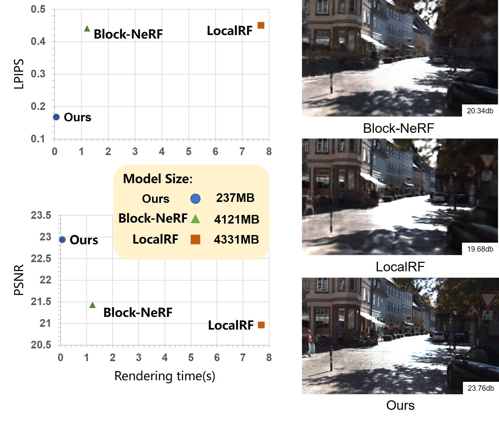

# DGNR: Density-Guided Neural Point Rendering of Large Driving Scenes
 [Paper](https://arxiv.org/abs/2311.16664)  
## Overview: 

PyTorch implementation of DGNR.



<!---
%
-->
The following instructions describe installation of conda environment.  Please refer to [requirement](https://github.com/JOP-Lee/DGNR-Rendering/blob/main/requirement.sh).
.

## Train
```bash
python train.py --config configs/train_example.yaml --pipeline READ.pipelines.ogl.TexturePipeline --crop_size 256x256
```

*For devices without a display, training and testing can be done using headless rendering, but the efficiency will be 2-3 times slower. It is preferable to use devices with a display for rendering.

```bash
xvfb-run --auto-servernum --server-args="-screen 0 1280x360x24" python train.py --config configs/train_example.yaml --pipeline READ.pipelines.ogl.TexturePipeline --crop_size 256x256
```

The size of crop_size depends on your GPU memory and the parameter train_dataset_args can be adjusted in the configs folder. 
For high-resolution images, it is necessary first to train them with a low-resolution downsampled version and then train them at a higher resolution. For example, during the initial training, the range of random_zoom is set to 1.0-2.0 with num_samples=3000. Then, the model is loaded and fine-tuned with a modified range of random_zoom set to 0.7-2.0 and num_samples=6000.


## Viewer

```bash
python viewer.py --config downloads/kitti11.yaml
```
*headless rendering
```bash
python viewer_numpy.py --config downloads/kitti11.yaml
```
